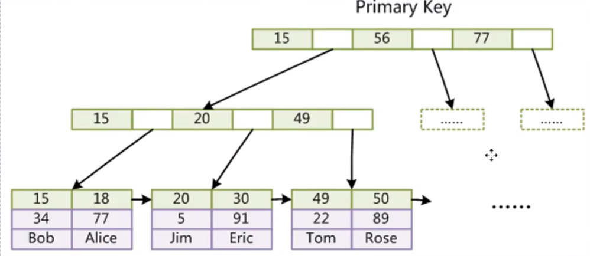

# mysql索引数据结构与性能优化

## 内容

1.索引数据结构红黑树、hash、b+tree树详解

2.千万级数据表如何用索引快速查找

3、如何基于索引b+tree精确建立高性能索引

4、联合索引底层数据结构又是怎样的

5、聚集索引与覆盖索引到底是什么

6、mysql最左前缀优化原则是怎么回事

7、为什么dba总推荐使用自增主键做索引

8、mysql索引优化军规


## 索引的本质

索引是帮助mysql高效获取数据的**排好序**的**数据结构**

索引数据结构

- 二叉树
- 红黑树
- hash表
- b-tree


如下sql举例：

```sql
select * from t where t.col2 = 89
```

如果没有索引，就会进行从上到下依次查找，经历6次查找获得结果。

假定我们一以col2的值建立**二叉树**索引，假定索引如图右边状态，那么就会进行2次查找获取数据。

又比如sql

```sql
select * from t where t.col1 = 6
```

根据col1进行查询，假定我们将col1建立二叉树索引，我们会发现其状态有可能如下

> 参考 Data Structure Visualizations： <https://www.cs.usfca.edu/~galles/visualization/Algorithms.html>


**极端情况下，二叉树会退化为链表**

### 平衡二叉树：红黑树

让我们先跳过红黑树的实现原理，单纯对比以上相同场景，红黑树的查找次数


显然还是以上这种情况，在我们陆续录入1-7的过程中，由于红黑树会通过变色和左旋实现树的再平衡，而导致我们查询6的时候，只需经历3步

#### 红黑树的弊端：

在海量数据的情况下，假定红黑树存了500万索引，那么树的高度是非常高的，导致索引变慢

#### 结论

如果树的高度可控，比如即使有500条数据，但是树的高度≤4，那即便从根节点进行查询，也最多就进行4次查询

> 思考：
>
> 如果我们相对红黑树的算法进行一些修改，让这颗树的高度一直维持在4，那思路是什么？
>
> 答案是：如果不能在纵向高度上进行扩展，就只能在横向宽度上扩展，比如：让一个节点存储在横向上存储多个节点，类似如下
>
> 
>
> **实际上这就是b-tree**

### b-tree

b-tree是一种多路平衡树

- 叶节点具有相同的深度，叶节点的指针为空
- 所有索引元素不重复
- 节点中的数据索引从左到右递增排序


mysql使用的b-tree的变种b+Tree

### B+Tree（B-Tree变种）

- 非叶子节点不存储data，只存储索引（冗余），可以放更多的索引
- 叶子节点包含所有索引字段
- 叶子节点用指针连接，提高区间访问的性能


由于数据都存在叶子节点，因此叶子节点包含了所有这张表的数据存储位置，并且会将部分索引在非叶子节点上做索引冗余，以组织一颗树

作为多路平衡树，但看一个节点的其中两个子节点，仍然符合二叉树的定义，并且mysql在同一节点中保存的索引会做排序。可以看到15>20>49,15>18>20>30>49>50

## mysql在的索引查找步骤

以上图为例，假定我们要查找索引30的数据，树的高度为3

1. 将根节点的索引一次性加载入内存ram，然后通过折半查找找到30所在位置，也就是15和56之间的空白区域
2. 这个空白区域实际并非空白，而是存储了对应分支节点的位置（磁盘地址）
3. 通过磁盘寻址找到分支节点（15,20,49）并加载如内存，再进行折半查找，找到30的位置在20-49之间空白处
4. 再通过磁盘寻址找到叶子节点（20,30）的位置，并将节点中30索引对应data（要么是数据磁盘地址要么就是数据）加载如内存，再通过磁盘寻址读取data数据返回给客户端。


## MyISAM存储引擎

存储引擎是针对表的，每张表都可以选择不同的存储引擎

MyISAM索引文件和数据文件是分离的（非聚集索引）


创建如下两表

```sql
create table test_innodb_lock (
	a int(11) not null,
    b varchar(255) default null,
    KEY idx_a (a),
	KEY idx_b (b)
) ENGINE = InnoDB default charset=utf8;

create table test_myisam (
	id int(11) not null auto_increment,
    name varchar(255) default null,
	primary key(id)
) ENGINE=MyISAM auto_increment=2 default charset=utf8;
```

检视mysql data目录，注意以下三文件


- test_myisam.frm: 存储表的结构
- test_myisam.MYD: 存储表的数据
- test_mysiam.MYI：存储表的索引

从以上三个文件也可以看出，MyISAM存储引擎的索引是**非聚集**的，也就是数据与索引分离

MyISAM现实场景下使用率不多，原因大家思考下。

## Innodb存储引擎

观察`test_innodb_lock`相关文件

mysql老版本中：


5.5之后：


可以发现无论是老版本还是新版本，都有一个ibd文件，其中保存了索引+数据

### innodb索引实现（聚集）

- 表数据文件本身就是按b+tree组织的一个索引结构文件
- 聚集索引-叶节点包含了完整的数据记录
- 对于主键索引，本身保存了主键的索引和所有数据，换句话说，数据存在主键索引里
- 对于第二索引，除了保存索引结构以外，还包含了对应的主键数据（非聚集索引）




> 思考：
>
> MyISAM和Innodb建立的两种索引形式哪个会快一些？

### 面试题

#### 1.为什么Innodb表必须有主键，并且推荐使用整型的自增？

先来说下Innodb的一个特点：

当Innodb表没有主键时，mysql会遍历表的所有列，直到找到一列的数据是唯一的，然后将其设置为主键，如果没有找到，就建立一列隐藏列作为主键

1）为什么要有主键

因为mysql拿主键来作为索引维护b+tree，没有指定主键，mysql会自己指定，耗费cpu时间和磁盘io

2）为什么是整型？

因为b+tree中，同一节点下的索引是要排序的，在查找过程中，拿整型进行二分查找，显然要比诸如字符串的比对要快得多，比如：

```
1<2
aaaaaaaaab<aaaaaaaaa
```

明白了以上问题，也就不难理解为什么不建议拿UUID或者GUID作为主键id了

**另外**，整型bigint只占8字节，而uuid如果是字符串类型，占36个字节，根据innodb_page_size计算，显然整型在相同高度下，可维护的数据更多

3）为什么要自增？

要说明为什么要自增，我们先了解mysql的另外一种索引结构：Hash表

> HASH索引：
>
> 简而言之，hash索引就是通过hash算法，将索引值映射到其数据存储磁盘io地址上，比如下表：
>
> | 磁盘地址 | 索引hash |
> | -------- | -------- |
> | 0x01     | hash(1)  |
>
> 看以下sql
>
> ```sql
> select * from table1 where id = 22
> ```
>
> 此时，hash索引会通过调用hash方法hash(22)获得磁盘地址的hash映射
>
> 看上去，hash索引比b+tree要快的多，因为无论有多少数据，其查找步长都为1，也就是调用一次hash计算.
>
> 那为什么mysql还是默认用b+tree建立索引呢？
>
> 答案是：范围查找，试想以下的查找sql
>
> ```sql
> select * from table1 where id > 22
> ```
>
> 如果是hash索引，几乎只能通过遍历全表来进行范围查找，而b+tree却不一样


通过叶子节点的索引，b+tree就可以实现查找后续数据，或者查找之前数据，这样就能实现快速范围查找

**根据b+tree的插入逻辑，如果我们用自增的索引值时，当我们插入新值时，是不会触发b+tree的节点分裂和再平衡的，再平衡是要大量消耗磁盘io的，这就是为什么推荐自增的原因**

> 思考：用数据结构可视化来模拟在b+tree中存储uuid，观察uuid的坏处

#### 2 为什么mysql用b+tree而不用b tree？

由于mysql的b+tree在非叶子节点上冗余了索引，并且不存储数据，导致在相同的高度情况下，b+tree存储的数据量要远大于b tree，使得索引的查询效率高于b树

#### 3.为什么非主键索引结构叶子结点存储的是主键值

**1. 保持一致性：**
当数据库表进行DML操作时，同一行记录的页地址会发生改变，因非主键索引保存的是主键的值，无需进行更改。

**2. 节省存储空间：**
Innodb数据本身就已经汇聚到主键索引所在的B+树上了， 如果普通索引还继续再保存一份数据，就会导致有多少索引就要存多少份数据。

#### 4 联合索引的底层存储结构是什么样的？

建立一张具有联合索引的表

```sql
CREATE TABLE employees(
	id int(11) not null auto_increment,
    name varchar(24) not null,
    age int(11),
    position varchar(20),
    hire_time timestamp,
    prmary key (id),
    key idx_name_age_position (name,age,position) using btree
) engine=InnoDb AUTO_INCREMENT=4 DEFAULT CHARSET=utf8;

INSERT INTO employees(name,age,position,hire_time) values("LiLei",22,'manager',NOW());
INSERT INTO employees(name,age,position,hire_time) values("HanMeiMei",23,'dev',NOW());
INSERT INTO employees(name,age,position,hire_time) values("Lucy",23,'dev',NOW());
```

联合索引如图


##### 联合主键的比较规则

按照建立索引时，字段从左到右的顺序，来依次比较字段，如果第一个字段已经能比较出结果，就直接寻址，如果没有结果，再比第二个字段，直到找到位置，因此，也衍生出了mysql索引的最左前缀原理

##### 索引最左前缀法则

如果索引了多列，要遵守此法则，指的是查询从索引的最左前列开始并且不跳过索引的列

```sql
EXPLAIN select * from employees where name = "LiLei" and age = 31；
ExPLAIN select * from employees where age = 31 and position = "dev"；
ExPLAIN select * from employees where position = "dev"；
```

检视以上三行的结果，会发现，只有第一句sql走了索引


最左前缀的原则是，只有当最左边的前缀是通过法则