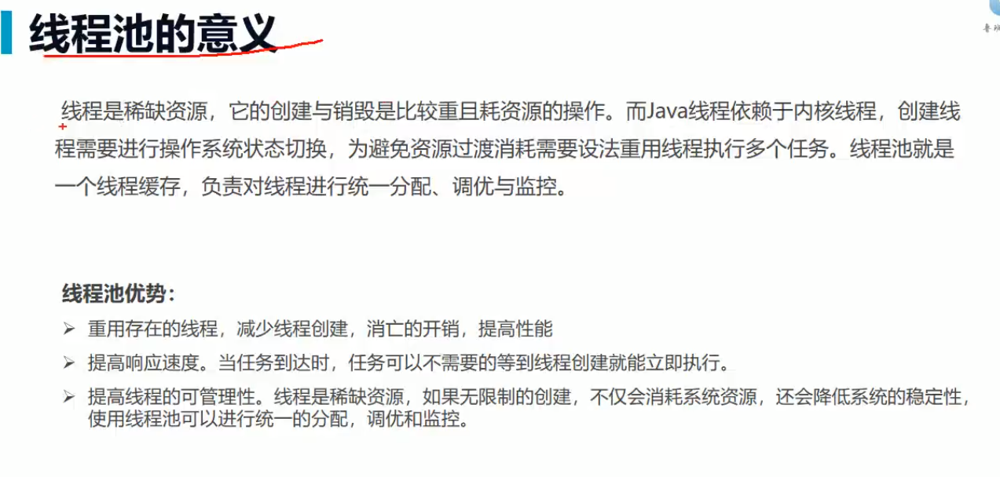

https://www.cnblogs.com/xiguadadage/p/10243332.html

https://blog.csdn.net/qq_34391845/article/details/106323304

#### 1.线程池的目的

线程池可以复用线程，减少线程创建消亡的开销，避免用户态和内核态的来回切换



#### 2.线程池的使用

java的excutor体系


#### 3.excutors工具类创建线程池

```java
Executors.newCachedThreadPool();//创建缓冲线程池，缓冲线程池会根据任务数量以及任务的执行时间，动态控制线程数量
Executors.newScheduledThreadPool(5);//创建计划任务的线程池
Executors.newSingleThreadExecutor();//创建单线程的线程池
Executors.newFixedThreadPool(5);//创建固定线程数量的线程池
```


**注意**：excutors创建的线程池在实际开发中明确不允许使用，因为有坑，都有可能出现oom，因为其创建的阻塞队列大小是max_value，意味着这个队列可能会无限的缓存任务，造成内存溢出


####  自定义创建线程池

```java

 new ThreadPoolExecutor(2,3,60, TimeUnit.SECONDS,new ArrayBlockingQueue<>(5), Executors.defaultThreadFactory());
```


```java
public ThreadPoolExecutor(int corePoolSize,
                              int maximumPoolSize,
                              long keepAliveTime,
                              TimeUnit unit,
                              BlockingQueue<Runnable> workQueue,
                              ThreadFactory threadFactory,
                              RejectedExecutionHandler handler) {
        if (corePoolSize < 0 ||
            maximumPoolSize <= 0 ||
            maximumPoolSize < corePoolSize ||
            keepAliveTime < 0)
            throw new IllegalArgumentException();
        if (workQueue == null || threadFactory == null || handler == null)
            throw new NullPointerException();
        this.corePoolSize = corePoolSize;
        this.maximumPoolSize = maximumPoolSize;
        this.workQueue = workQueue;
        this.keepAliveTime = unit.toNanos(keepAliveTime);
        this.threadFactory = threadFactory;
        this.handler = handler;
    }
```


参数解释：

corePoolSize: 池中固定的线程数量

maximumPoolSize:当排队等待的线程超过了固定线程+阻塞队列容量后，最多能增加到的线程数量

keepAliveTime：当任务负载下来后，空闲临时线程多少时间后自动释放资源

unit:时间单位

BlockingQueue：用于存放任务的阻塞队列

threadFactory:创建线程的工厂

RejectedExecutionHandler：阻塞队列已满，且工作线程也已满的情况下，拒绝任务的策略


AbortPolcy：抛出RejectedExecutionException异常

DiscardPolicy:什么也不做

DiscardOldestPolicy：丢弃队列最前面的一个任务，然后重新尝试执行当前任务

CallerRunsPolicy：用当前调用任务的线程来执行任务，

#### 线程池执行流程


#### 如何合理设置线程池大小

cpu密集型：设置线程数为cpu核数+1

io密集型：系统大部分时间在处理io交互，不会占用cpu资源，那么多配置一些线程 2*cpu核数

##### 场景案例：

定时向客户推送消息：

（算等待时间+运算时间/运算时间）*cpu核心数

实际场景还是要通过压测去实践

#### **常用的几种队列**

（1）ArrayBlockingQueue：规定大小的BlockingQueue，其构造必须指定大小。其所含的对象是FIFO顺序排序的。

（2）LinkedBlockingQueue：大小不固定的BlockingQueue，若其构造时指定大小，生成的BlockingQueue有大小限制，不指定大小，其大小有Integer.MAX_VALUE来决定。其所含的对象是FIFO顺序排序的。

（3）PriorityBlockingQueue：类似于LinkedBlockingQueue，但是其所含对象的排序不是FIFO，而是依据对象的自然顺序或者构造函数的Comparator决定。

（4）SynchronizedQueue：特殊的BlockingQueue，对其的操作必须是放和取交替完成。

#### 线程池源码分析

# Java线程池实现原理与源码解析(jdk1.8)


[猪杂汤饭](https://blog.csdn.net/programmer_at) 2018-04-03 10:09:49  24981  收藏 76

分类专栏： [个人总结](https://blog.csdn.net/programmer_at/category_2404873.html) [Java](https://blog.csdn.net/programmer_at/category_6095887.html) 文章标签： [java](https://www.csdn.net/tags/NtTaIg5sMzYyLWJsb2cO0O0O.html) [线程池](https://www.csdn.net/tags/MtTaEg0sMTEwMjYtYmxvZwO0O0OO0O0O.html) [jdk](https://www.csdn.net/tags/MtTaEg0sMjY5NzQtYmxvZwO0O0OO0O0O.html) [源码](https://so.csdn.net/so/search/s.do?q=%E6%BA%90%E7%A0%81&t=blog&o=vip&s=&l=&f=&viparticle=) [线程](https://www.csdn.net/tags/MtTaEg0sMTEwNDEtYmxvZwO0O0OO0O0O.html)

版权

为什么需要线程池？
线程池能够对线程进行统一分配，调优和监控：
\- 降低资源消耗（线程无限制地创建，然后使用完毕后销毁）
\- 提高响应速度（无须创建线程）
\- 提高线程的可管理性

Java是如何实现和管理线程池的?
从JDK 5开始，把工作单元与执行机制分离开来，工作单元包括`Runnable`和`Callable`，而执行机制有Executor框架提供。


> ScheduledThreadPool
> 初始化的线程池可以在指定的时间内周期性的执行所提交的任务，在实际的业务场景中可以使用该线程池定期的同步数据。


- - [1. 工作原理](https://blog.csdn.net/programmer_at/article/details/79799267#1-%E5%B7%A5%E4%BD%9C%E5%8E%9F%E7%90%86)
  - \2. ThreadPoolExecutor
    - \3. 创建线程池
      - [3.1 参数](https://blog.csdn.net/programmer_at/article/details/79799267#31-%E5%8F%82%E6%95%B0)
      - 3.2 三种类型
        - [3.2.1 newFixedThreadPool](https://blog.csdn.net/programmer_at/article/details/79799267#321-newfixedthreadpool)
        - [3.2.2 newSingleThreadExecutor](https://blog.csdn.net/programmer_at/article/details/79799267#322-newsinglethreadexecutor)
        - [3.2.3 newCachedThreadPool](https://blog.csdn.net/programmer_at/article/details/79799267#323-newcachedthreadpool)
    - 3.3 关闭线程池
      - [3.3.1 原理](https://blog.csdn.net/programmer_at/article/details/79799267#331-%E5%8E%9F%E7%90%86)
      - [3.3.2 关闭方式](https://blog.csdn.net/programmer_at/article/details/79799267#332-%E5%85%B3%E9%97%AD%E6%96%B9%E5%BC%8F)
  - \4. ThreadPoolExecutor源码
    - [4.1 内部状态](https://blog.csdn.net/programmer_at/article/details/79799267#41-%E5%86%85%E9%83%A8%E7%8A%B6%E6%80%81)
    - 4.2 任务的执行
      - [4.2.1 execute()方法](https://blog.csdn.net/programmer_at/article/details/79799267#421-execute%E6%96%B9%E6%B3%95)
      - [4.2.2 addWorker方法](https://blog.csdn.net/programmer_at/article/details/79799267#422-addworker%E6%96%B9%E6%B3%95)
      - [4.2.3 Worker类的runworker方法](https://blog.csdn.net/programmer_at/article/details/79799267#423-worker%E7%B1%BB%E7%9A%84runworker%E6%96%B9%E6%B3%95)
      - [4.2.4 getTask方法](https://blog.csdn.net/programmer_at/article/details/79799267#424-gettask%E6%96%B9%E6%B3%95)
    - 4.3 任务的提交
      - [4.3.1 submit方法](https://blog.csdn.net/programmer_at/article/details/79799267#431-submit%E6%96%B9%E6%B3%95)
      - 4.3.2 FutureTask对象
        - [内部状态](https://blog.csdn.net/programmer_at/article/details/79799267#%E5%86%85%E9%83%A8%E7%8A%B6%E6%80%81)
        - [get方法](https://blog.csdn.net/programmer_at/article/details/79799267#get%E6%96%B9%E6%B3%95)
        - [run方法](https://blog.csdn.net/programmer_at/article/details/79799267#run%E6%96%B9%E6%B3%95)
  - [5. 配置线程池需要考虑哪些因素](https://blog.csdn.net/programmer_at/article/details/79799267#5-%E9%85%8D%E7%BD%AE%E7%BA%BF%E7%A8%8B%E6%B1%A0%E9%9C%80%E8%A6%81%E8%80%83%E8%99%91%E5%93%AA%E4%BA%9B%E5%9B%A0%E7%B4%A0)
  - [6. 如何监控线程池的状态](https://blog.csdn.net/programmer_at/article/details/79799267#6-%E5%A6%82%E4%BD%95%E7%9B%91%E6%8E%A7%E7%BA%BF%E7%A8%8B%E6%B1%A0%E7%9A%84%E7%8A%B6%E6%80%81)
  - [Reference](https://blog.csdn.net/programmer_at/article/details/79799267#reference)


## 1. 工作原理

当一个任务提交至线程池之后，
\1. 线程池首先判断**核心线程池**里的线程是否已经满了。如果不是，则创建一个新的工作线程来执行任务。否则进入2.
\2. 判断**工作队列**是否已经满了，倘若还没有满，将线程放入工作队列。否则进入3.
\3. 判断**线程池**里的线程是否都在执行任务。如果不是，则创建一个新的工作线程来执行。如果线程池满了，则交给**饱和策略**来处理任务。

ThreadPoolExecutor执行execute()流程：
当一个任务提交至线程池之后，
\1. 线程池首先当前运行的线程数量是否少于**corePoolSize**。如果是，则创建一个新的工作线程来执行任务。如果都在执行任务，则进入2.
\2. 判断**BlockingQueue**是否已经满了，倘若还没有满，则将线程放入**BlockingQueue**。否则进入3.
\3. 如果创建一个新的工作线程将使当前运行的线程数量超过**maximumPoolSize**，则交给**RejectedExecutionHandler**来处理任务。

当ThreadPoolExecutor创建新线程时，通过CAS来更新线程池的状态`ctl`.

## 2. ThreadPoolExecutor

### 3. 创建线程池

#### 3.1 参数

```
public ThreadPoolExecutor(int corePoolSize,
                              int maximumPoolSize,
                              long keepAliveTime,
                              TimeUnit unit,
                              BlockingQueue<Runnable> workQueue,
                              RejectedExecutionHandler handler)123456
```

- corePoolSize
  线程池中的核心线程数，当提交一个任务时，线程池创建一个新线程执行任务，直到当前线程数等于corePoolSize, **即使有其他空闲线程能够执行新来的任务, 也会继续创建线程**；如果当前线程数为corePoolSize，继续提交的任务被保存到阻塞队列中，等待被执行；如果执行了线程池的prestartAllCoreThreads()方法，线程池会提前创建并启动所有核心线程。

- workQueue
  用来保存等待被执行的任务的阻塞队列. 在JDK中提供了如下阻塞队列：
  (1) ArrayBlockingQueue：基于数组结构的有界阻塞队列，按FIFO排序任务；
  (2) LinkedBlockingQuene：基于链表结构的阻塞队列，按FIFO排序任务，吞吐量通常要高于ArrayBlockingQuene；
  (3) SynchronousQuene：一个不存储元素的阻塞队列，每个插入操作必须等到另一个线程调用移除操作，否则插入操作一直处于阻塞状态，吞吐量通常要高于LinkedBlockingQuene；
  (4) priorityBlockingQuene：具有优先级的无界阻塞队列；

  > LinkedBlockingQueue比ArrayBlockingQueue在插入删除节点性能方面更优，但是二者在put(), take()任务的时均需要加锁，SynchronousQueue使用无锁算法，根据节点的状态判断执行，而不需要用到锁，其核心是Transfer.transfer().

- maximumPoolSize
  线程池中允许的最大线程数。如果当前阻塞队列满了，且继续提交任务，则创建新的线程执行任务，前提是当前线程数小于maximumPoolSize；当阻塞队列是无界队列, 则maximumPoolSize则不起作用, 因为无法提交至核心线程池的线程会一直持续地放入workQueue.

- keepAliveTime
  线程空闲时的存活时间，即当线程没有任务执行时，该线程继续存活的时间；默认情况下，该参数只在线程数大于`corePoolSize`时才有用, 超过这个时间的空闲线程将被终止；

- unit
  keepAliveTime的单位

- threadFactory
  创建线程的工厂，通过自定义的线程工厂可以给每个新建的线程设置一个具有识别度的线程名。默认为`DefaultThreadFactory`

- handler

  handler

  线程池的饱和策略，当阻塞队列满了，且没有空闲的工作线程，如果继续提交任务，必须采取一种策略处理该任务，线程池提供了4种策略：

  - AbortPolicy：直接抛出异常，默认策略；
  - CallerRunsPolicy：用调用者所在的线程来执行任务；
  - DiscardOldestPolicy：丢弃阻塞队列中靠最前的任务，并执行当前任务；
  - DiscardPolicy：直接丢弃任务；
    当然也可以根据应用场景实现RejectedExecutionHandler接口，自定义饱和策略，如记录日志或持久化存储不能处理的任务。

#### 3.2 三种类型

##### 3.2.1 newFixedThreadPool

```
public static ExecutorService newFixedThreadPool(int nThreads) {
        return new ThreadPoolExecutor(nThreads, nThreads,
                                      0L, TimeUnit.MILLISECONDS,
                                      new LinkedBlockingQueue<Runnable>());
    }12345
```

线程池的线程数量达corePoolSize后，即使线程池没有可执行任务时，也不会释放线程。

FixedThreadPool的工作队列为无界队列`LinkedBlockingQueue`(队列容量为`Integer.MAX_VALUE`), 这会导致以下问题:
\- 线程池里的线程数量不超过`corePoolSize`,这导致了`maximumPoolSize`和`keepAliveTime`将会是个无用参数
\- 由于使用了无界队列, 所以FixedThreadPool永远不会拒绝, 即饱和策略失效

##### 3.2.2 newSingleThreadExecutor

```
public static ExecutorService newSingleThreadExecutor() {
        return new FinalizableDelegatedExecutorService
            (new ThreadPoolExecutor(1, 1,
                                    0L, TimeUnit.MILLISECONDS,
                                    new LinkedBlockingQueue<Runnable>()));
    }123456
```

初始化的线程池中只有一个线程，如果该线程异常结束，会重新创建一个新的线程继续执行任务，唯一的线程可以保证所提交任务的顺序执行.

由于使用了无界队列, 所以SingleThreadPool永远不会拒绝, 即饱和策略失效

##### 3.2.3 newCachedThreadPool

```
public static ExecutorService newCachedThreadPool() {
        return new ThreadPoolExecutor(0, Integer.MAX_VALUE,
                                      60L, TimeUnit.SECONDS,
                                      new SynchronousQueue<Runnable>());
    }12345
```

1. 线程池的线程数可达到Integer.MAX_VALUE，即2147483647，内部使用SynchronousQueue作为阻塞队列；
2. 和newFixedThreadPool创建的线程池不同，newCachedThreadPool在没有任务执行时，当线程的空闲时间超过keepAliveTime，会自动释放线程资源，当提交新任务时，如果没有空闲线程，则创建新线程执行任务，会导致一定的系统开销；

执行过程与前两种稍微不同:
(1) 主线程调用SynchronousQueue的offer()方法放入task, 倘若此时线程池中有空闲的线程尝试读取 SynchronousQueue的task, 即调用了SynchronousQueue的poll(), 那么主线程将该task交给空闲线程. 否则执行(2)
(2) 当线程池为空或者没有空闲的线程, 则创建新的线程执行任务.
(3) 执行完任务的线程倘若在60s内仍空闲, 则会被终止. 因此长时间空闲的CachedThreadPool不会持有任何线程资源.

### 3.3 关闭线程池

#### 3.3.1 原理

遍历线程池中的所有线程，然后逐个调用线程的`interrupt`方法来中断线程.

#### 3.3.2 关闭方式

- shutdown
  将线程池里的线程状态设置成SHUTDOWN状态, 然后中断所有没有正在执行任务的线程.
- shutdownNow
  将线程池里的线程状态设置成STOP状态, 然后停止所有正在执行或暂停任务的线程.

只要调用这两个关闭方法中的任意一个, `isShutDown()` 返回true.
当所有任务都成功关闭了, `isTerminated()`返回true.

## 4. ThreadPoolExecutor源码

> 基于JDK1.8

### 4.1 内部状态

```java
    private final AtomicInteger ctl = new AtomicInteger(ctlOf(RUNNING, 0));
    private static final int COUNT_BITS = Integer.SIZE - 3;
    private static final int CAPACITY   = (1 << COUNT_BITS) - 1;

    // runState is stored in the high-order bits
    private static final int RUNNING    = -1 << COUNT_BITS;
    private static final int SHUTDOWN   =  0 << COUNT_BITS;
    private static final int STOP       =  1 << COUNT_BITS;
    private static final int TIDYING    =  2 << COUNT_BITS;
    private static final int TERMINATED =  3 << COUNT_BITS;

    // Packing and unpacking ctl
    private static int runStateOf(int c)     { return c & ~CAPACITY; }
    private static int workerCountOf(int c)  { return c & CAPACITY; }
    private static int ctlOf(int rs, int wc) { return rs | wc; }123456789101112131415
```

其中AtomicInteger变量ctl的功能非常强大：利用低29位表示线程池中线程数，通过高3位表示线程池的运行状态：
1、RUNNING：-1 << COUNT_BITS，即高3位为111，该状态的线程池会接收新任务，并处理阻塞队列中的任务；
2、SHUTDOWN： 0 << COUNT_BITS，即高3位为000，该状态的线程池不会接收新任务，但会处理阻塞队列中的任务；
3、STOP ： 1 << COUNT_BITS，即高3位为001，该状态的线程不会接收新任务，也不会处理阻塞队列中的任务，而且会中断正在运行的任务；
4、TIDYING ： 2 << COUNT_BITS，即高3位为010, 所有的任务都已经终止；
5、TERMINATED： 3 << COUNT_BITS，即高3位为011, `terminated()`方法已经执行完成


### 4.2 任务的执行

> execute –> addWorker –>runworker （getTask）
> 线程池的工作线程通过Woker类实现，在ReentrantLock锁的保证下，把Woker实例插入到HashSet后，并启动Woker中的线程。
> 从Woker类的构造方法实现可以发现：线程工厂在创建线程thread时，将Woker实例本身this作为参数传入，当执行start方法启动线程thread时，本质是执行了Worker的runWorker方法。
> firstTask执行完成之后，通过getTask方法从阻塞队列中获取等待的任务，如果队列中没有任务，getTask方法会被阻塞并挂起，不会占用cpu资源；

#### 4.2.1 execute()方法

```
ThreadPoolExecutor.execute(task)`实现了`Executor.execute(task)
public void execute(Runnable command) {
    if (command == null)
        throw new NullPointerException();
    /*
     * Proceed in 3 steps:
     *
     * 1. If fewer than corePoolSize threads are running, try to
     * start a new thread with the given command as its first
     * task.  The call to addWorker atomically checks runState and
     * workerCount, and so prevents false alarms that would add
     * threads when it shouldn't, by returning false.
     *
     * 2. If a task can be successfully queued, then we still need
     * to double-check whether we should have added a thread
     * (because existing ones died since last checking) or that
     * the pool shut down since entry into this method. So we
     * recheck state and if necessary roll back the enqueuing if
     * stopped, or start a new thread if there are none.
     *
     * 3. If we cannot queue task, then we try to add a new
     * thread.  If it fails, we know we are shut down or saturated
     * and so reject the task.
     */
    int c = ctl.get();
    if (workerCountOf(c) < corePoolSize) {  
    //workerCountOf获取线程池的当前线程数；小于corePoolSize，执行addWorker创建新线程执行command任务
       if (addWorker(command, true))
            return;
        c = ctl.get();
    }
    // double check: c, recheck
    // 线程池处于RUNNING状态，把提交的任务成功放入阻塞队列中
    if (isRunning(c) && workQueue.offer(command)) {
        int recheck = ctl.get();
        // recheck and if necessary 回滚到入队操作前，即倘若线程池shutdown状态，就remove(command)
        //如果线程池没有RUNNING，成功从阻塞队列中删除任务，执行reject方法处理任务
        if (! isRunning(recheck) && remove(command))
            reject(command);
        //线程池处于running状态，但是没有线程，则创建线程
        else if (workerCountOf(recheck) == 0)
            addWorker(null, false);
    }
    // 往线程池中创建新的线程失败，则reject任务
    else if (!addWorker(command, false))
        reject(command);
}12345678910111213141516171819202122232425262728293031323334353637383940414243444546
```

> 为什么需要double check线程池的状态？
> 在多线程环境下，线程池的状态时刻在变化，而`ctl.get()`是非原子操作，很有可能刚获取了线程池状态后线程池状态就改变了。判断是否将command加入workque是线程池之前的状态。倘若没有double check，万一线程池处于非running状态（在多线程环境下很有可能发生），那么command永远不会执行。

#### 4.2.2 addWorker方法

从方法execute的实现可以看出：addWorker主要负责创建新的线程并执行任务
线程池创建新线程执行任务时，需要 获取全局锁：

```java
private final ReentrantLock mainLock = new ReentrantLock();1
private boolean addWorker(Runnable firstTask, boolean core) {
       // CAS更新线程池数量
        retry:
        for (;;) {
            int c = ctl.get();
            int rs = runStateOf(c);

            // Check if queue empty only if necessary.
            if (rs >= SHUTDOWN &&
                ! (rs == SHUTDOWN &&
                   firstTask == null &&
                   ! workQueue.isEmpty()))
                return false;

            for (;;) {
                int wc = workerCountOf(c);
                if (wc >= CAPACITY ||
                    wc >= (core ? corePoolSize : maximumPoolSize))
                    return false;
                if (compareAndIncrementWorkerCount(c))
                    break retry;
                c = ctl.get();  // Re-read ctl
                if (runStateOf(c) != rs)
                    continue retry;
                // else CAS failed due to workerCount change; retry inner loop
            }
        }

        boolean workerStarted = false;
        boolean workerAdded = false;
        Worker w = null;
        try {
            w = new Worker(firstTask);
            final Thread t = w.thread;
            if (t != null) {
                // 线程池重入锁
                final ReentrantLock mainLock = this.mainLock;
                mainLock.lock();
                try {
                    // Recheck while holding lock.
                    // Back out on ThreadFactory failure or if
                    // shut down before lock acquired.
                    int rs = runStateOf(ctl.get());

                    if (rs < SHUTDOWN ||
                        (rs == SHUTDOWN && firstTask == null)) {
                        if (t.isAlive()) // precheck that t is startable
                            throw new IllegalThreadStateException();
                        workers.add(w);
                        int s = workers.size();
                        if (s > largestPoolSize)
                            largestPoolSize = s;
                        workerAdded = true;
                    }
                } finally {
                    mainLock.unlock();
                }
                if (workerAdded) {
                    t.start();  // 线程启动，执行任务（Worker.thread(firstTask).start()）;
                    workerStarted = true;
                }
            }
        } finally {
            if (! workerStarted)
                addWorkerFailed(w);
        }
        return workerStarted;
    }1234567891011121314151617181920212223242526272829303132333435363738394041424344454647484950515253545556575859606162636465666768
```

#### 4.2.3 Worker类的runworker方法

```
 private final class Worker
         extends AbstractQueuedSynchronizer
         implements Runnable{
     Worker(Runnable firstTask) {
         setState(-1); // inhibit interrupts until runWorker
         this.firstTask = firstTask;
         this.thread = getThreadFactory().newThread(this); // 创建线程
     }
     /** Delegates main run loop to outer runWorker  */
     public void run() {
         runWorker(this);
     }
     // ...
 }1234567891011121314
```

- 继承了AQS类，可以方便的实现工作线程的中止操作；
- 实现了Runnable接口，可以将自身作为一个任务在工作线程中执行；
- 当前提交的任务firstTask作为参数传入Worker的构造方法；

runWorker方法是线程池的核心：
\1. 线程启动之后，通过unlock方法释放锁，设置AQS的state为0，表示运行可中断；
\2. Worker执行firstTask或从workQueue中获取任务：
2.1. 进行加锁操作，保证thread不被其他线程中断（除非线程池被中断）
2.2. 检查线程池状态，倘若线程池处于中断状态，当前线程将中断。
2.3. 执行beforeExecute
2.4 执行任务的run方法
2.5 执行afterExecute方法
2.6 解锁操作

> 通过getTask方法从阻塞队列中获取等待的任务，如果队列中没有任务，getTask方法会被阻塞并挂起，不会占用cpu资源；

```java
final void runWorker(Worker w) {
        Thread wt = Thread.currentThread();
        Runnable task = w.firstTask;
        w.firstTask = null;
        w.unlock(); // allow interrupts
        boolean completedAbruptly = true;
        try {
            // 先执行firstTask，再从workerQueue中取task（getTask())

            while (task != null || (task = getTask()) != null) {
                w.lock();
                // If pool is stopping, ensure thread is interrupted;
                // if not, ensure thread is not interrupted.  This
                // requires a recheck in second case to deal with
                // shutdownNow race while clearing interrupt
                if ((runStateAtLeast(ctl.get(), STOP) ||
                     (Thread.interrupted() &&
                      runStateAtLeast(ctl.get(), STOP))) &&
                    !wt.isInterrupted())
                    wt.interrupt();
                try {
                    beforeExecute(wt, task);
                    Throwable thrown = null;
                    try {
                        task.run();
                    } catch (RuntimeException x) {
                        thrown = x; throw x;
                    } catch (Error x) {
                        thrown = x; throw x;
                    } catch (Throwable x) {
                        thrown = x; throw new Error(x);
                    } finally {
                        afterExecute(task, thrown);
                    }
                } finally {
                    task = null;
                    w.completedTasks++;
                    w.unlock();
                }
            }
            completedAbruptly = false;
        } finally {
            processWorkerExit(w, completedAbruptly);
        }
    }123456789101112131415161718192021222324252627282930313233343536373839404142434445
```

#### 4.2.4 getTask方法

getTask方法从阻塞队列中获取等待的任务

```java
private Runnable getTask() {
    boolean timedOut = false; // Did the last poll() time out?

    for (;;) {
        int c = ctl.get();
        int rs = runStateOf(c);

        // Check if queue empty only if necessary.
        if (rs >= SHUTDOWN && (rs >= STOP || workQueue.isEmpty())) {
            decrementWorkerCount();
            return null;
        }

        int wc = workerCountOf(c);

        // Are workers subject to culling?
        boolean timed = allowCoreThreadTimeOut || wc > corePoolSize;

        if ((wc > maximumPoolSize || (timed && timedOut))
            && (wc > 1 || workQueue.isEmpty())) {
            if (compareAndDecrementWorkerCount(c))
                return null;
            continue;
        }

        try {
            Runnable r = timed ?
                workQueue.poll(keepAliveTime, TimeUnit.NANOSECONDS) :
                workQueue.take();
            if (r != null)
                return r;
            timedOut = true;
        } catch (InterruptedException retry) {
            timedOut = false;
        }
    }
}12345678910111213141516171819202122232425262728293031323334353637
```

注意这里一段代码是keepAliveTime起作用的关键：

```java
boolean timed = allowCoreThreadTimeOut || wc > corePoolSize;
Runnable r = timed ?
                workQueue.poll(keepAliveTime, TimeUnit.NANOSECONDS) :
                workQueue.take();1234
```

allowCoreThreadTimeOut为false，线程即使空闲也不会被销毁；倘若为ture，在keepAliveTime内仍空闲则会被销毁。
如果线程允许空闲等待而不被销毁`timed == false`，`workQueue.take`任务：如果阻塞队列为空，当前线程会被挂起等待；当队列中有任务加入时，线程被唤醒，take方法返回任务，并执行；
如果线程不允许无休止空闲`timed == true`, `workQueue.poll`任务：如果在keepAliveTime时间内，阻塞队列还是没有任务，则返回null；

### 4.3 任务的提交


\1. submit任务，等待线程池execute
\1. 执行FutureTask类的get方法时，会把主线程封装成WaitNode节点并保存在waiters链表中， 并阻塞等待运行结果；
\2. FutureTask任务执行完成后，通过UNSAFE设置waiters相应的waitNode为null，并通过LockSupport类unpark方法唤醒主线程；

```java
public class Test{

    public static void main(String[] args) {

        ExecutorService es = Executors.newCachedThreadPool();
        Future<String> future = es.submit(new Callable<String>() {
            @Override
            public String call() throws Exception {
                try {
                    TimeUnit.SECONDS.sleep(2);
                } catch (InterruptedException e) {
                    e.printStackTrace();
                }
                return "future result";
            }
        });
        try {
            String result = future.get();
            System.out.println(result);
        } catch (Exception e) {
            e.printStackTrace();
        }
    }
}123456789101112131415161718192021222324
```

在实际业务场景中，Future和Callable基本是成对出现的，Callable负责产生结果，Future负责获取结果。
\1. Callable接口类似于Runnable，只是Runnable没有返回值。
\2. Callable任务除了返回正常结果之外，如果发生异常，该异常也会被返回，即Future可以拿到异步执行任务各种结果；
\3. Future.get方法会导致主线程阻塞，直到Callable任务执行完成；

#### 4.3.1 submit方法

`AbstractExecutorService.submit()`实现了`ExecutorService.submit()`
可以获取执行完的返回值, 而`ThreadPoolExecutor` 是`AbstractExecutorService.submit()`的子类，所以submit方法也是ThreadPoolExecutor`的方法。

```java
// submit()在ExecutorService中的定义
<T> Future<T> submit(Callable<T> task);

<T> Future<T> submit(Runnable task, T result);

Future<?> submit(Runnable task);123456
// submit方法在AbstractExecutorService中的实现
public Future<?> submit(Runnable task) {
        if (task == null) throw new NullPointerException();
        // 通过submit方法提交的Callable任务会被封装成了一个FutureTask对象。
        RunnableFuture<Void> ftask = newTaskFor(task, null);
        execute(ftask);
        return ftask;
    }12345678
```

通过submit方法提交的Callable任务会被封装成了一个FutureTask对象。通过Executor.execute方法提交FutureTask到线程池中等待被执行，最终执行的是FutureTask的run方法；

#### 4.3.2 FutureTask对象

`public class FutureTask<V> implements RunnableFuture<V>` 可以将FutureTask提交至线程池中等待被执行（通过FutureTask的run方法来执行）

##### 内部状态

```java
    /* The run state of this task, initially NEW. 
     * ...
     * Possible state transitions:
     * NEW -> COMPLETING -> NORMAL
     * NEW -> COMPLETING -> EXCEPTIONAL
     * NEW -> CANCELLED
     * NEW -> INTERRUPTING -> INTERRUPTED
     */
    private volatile int state;
    private static final int NEW          = 0;
    private static final int COMPLETING   = 1;
    private static final int NORMAL       = 2;
    private static final int EXCEPTIONAL  = 3;
    private static final int CANCELLED    = 4;
    private static final int INTERRUPTING = 5;
    private static final int INTERRUPTED  = 6;12345678910111213141516
```

内部状态的修改通过`sun.misc.Unsafe`修改

##### get方法

```java
public V get() throws InterruptedException, ExecutionException {
        int s = state;
        if (s <= COMPLETING)
            s = awaitDone(false, 0L);
        return report(s);
    } 123456
```

内部通过awaitDone方法对主线程进行阻塞，具体实现如下：

```java
private int awaitDone(boolean timed, long nanos)
        throws InterruptedException {
        final long deadline = timed ? System.nanoTime() + nanos : 0L;
        WaitNode q = null;
        boolean queued = false;
        for (;;) {
            if (Thread.interrupted()) {
                removeWaiter(q);
                throw new InterruptedException();
            }

            int s = state;
            if (s > COMPLETING) {
                if (q != null)
                    q.thread = null;
                return s;
            }
            else if (s == COMPLETING) // cannot time out yet
                Thread.yield();
            else if (q == null)
                q = new WaitNode();
            else if (!queued)
                queued = UNSAFE.compareAndSwapObject(this, waitersOffset,q.next = waiters, q);
            else if (timed) {
                nanos = deadline - System.nanoTime();
                if (nanos <= 0L) {
                    removeWaiter(q);
                    return state;
                }
                LockSupport.parkNanos(this, nanos);
            }
            else
                LockSupport.park(this);
        }
    }1234567891011121314151617181920212223242526272829303132333435
```

1. 如果主线程被中断，则抛出中断异常；
2. 判断FutureTask当前的state，如果大于COMPLETING，说明任务已经执行完成，则直接返回；
3. 如果当前state等于COMPLETING，说明任务已经执行完，这时主线程只需通过yield方法让出cpu资源，等待state变成NORMAL；
4. 通过WaitNode类封装当前线程，并通过UNSAFE添加到waiters链表；
5. 最终通过LockSupport的park或parkNanos挂起线程；

##### run方法

```java
public void run() {
        if (state != NEW ||
            !UNSAFE.compareAndSwapObject(this, runnerOffset,
                                         null, Thread.currentThread()))
            return;
        try {
            Callable<V> c = callable;
            if (c != null && state == NEW) {
                V result;
                boolean ran;
                try {
                    result = c.call();
                    ran = true;
                } catch (Throwable ex) {
                    result = null;
                    ran = false;
                    setException(ex);
                }
                if (ran)
                    set(result);
            }
        } finally {
            // runner must be non-null until state is settled to
            // prevent concurrent calls to run()
            runner = null;
            // state must be re-read after nulling runner to prevent
            // leaked interrupts
            int s = state;
            if (s >= INTERRUPTING)
                handlePossibleCancellationInterrupt(s);
        }
    }1234567891011121314151617181920212223242526272829303132
```

FutureTask.run方法是在线程池中被执行的，而非主线程
\1. 通过执行Callable任务的call方法；
\2. 如果call执行成功，则通过set方法保存结果；
\3. 如果call执行有异常，则通过setException保存异常；

## 5. 配置线程池需要考虑哪些因素

从任务的优先级，任务的执行时间长短，任务的性质（CPU密集/ IO密集），任务的依赖关系这四个角度来分析。并且近可能地使用**有界的工作队列**。

性质不同的任务可用使用不同规模的线程池分开处理：
\- CPU密集型：尽可能少的线程，Ncpu+1
\- IO密集型：尽可能多的线程, Ncpu*2，比如数据库连接池
\- 混合型：CPU密集型的任务与IO密集型任务的执行时间差别较小，拆分为两个线程池；否则没有必要拆分。

## 6. 如何监控线程池的状态

可以使用`ThreadPoolExecutor`以下方法：
`getTaskCount()` Returns the **approximate** total number of tasks that have ever been scheduled for execution.
`getCompletedTaskCount()` Returns the approximate total number of tasks that have completed execution. 返回结果少于`getTaskCount()`。
`getLargestPoolSize()` Returns the largest number of threads that have ever simultaneously been in the pool. 返回结果小于等于`maximumPoolSize`
`getPoolSize()` Returns the current number of threads in the pool.
`getActiveCount()` Returns the approximate number of threads that are actively executing tasks.

## Reference

